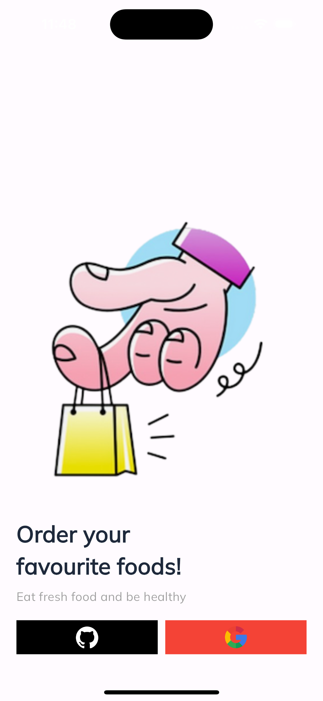
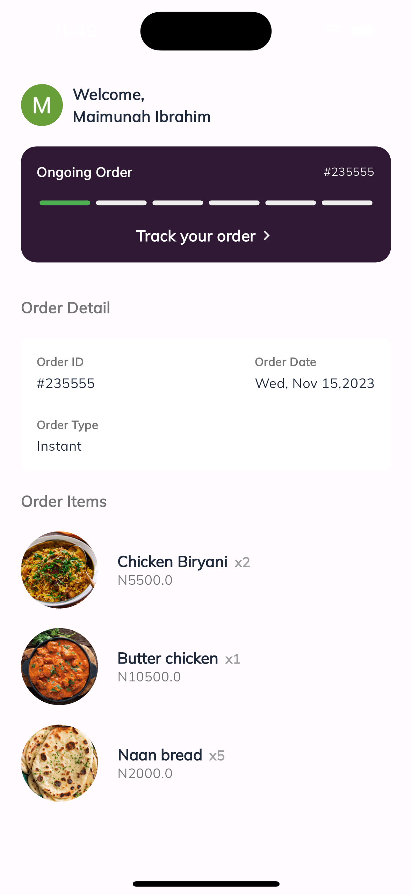
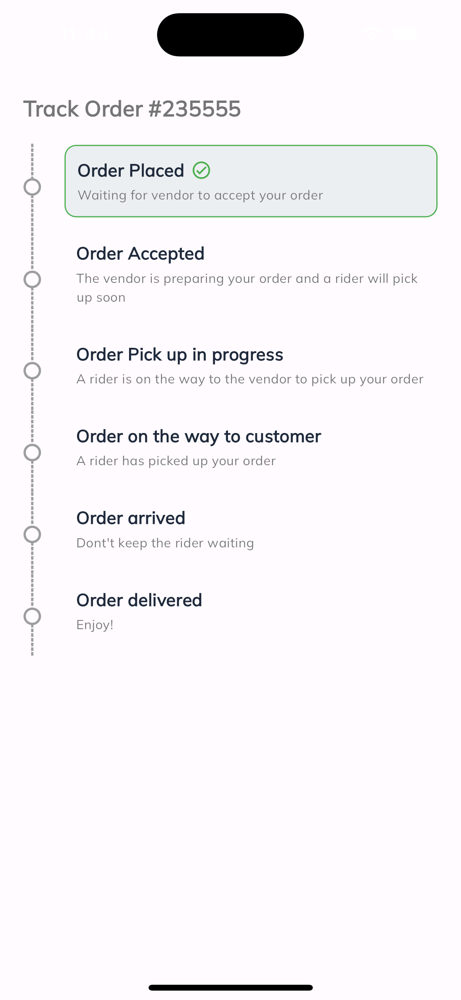
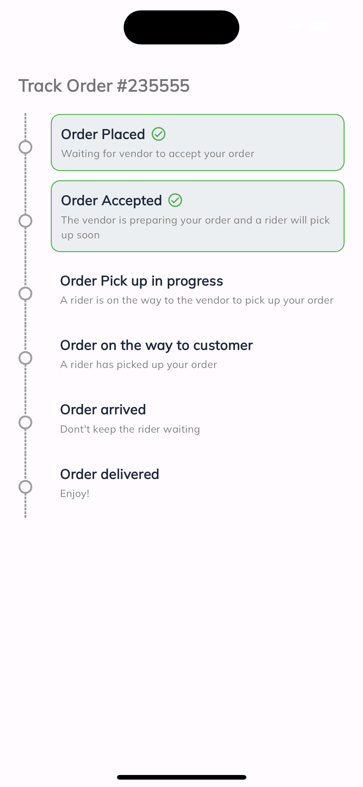

# order_tracking

Real Time on Ably Steps:
- This can also be found under lib/viewmodel/status_viewmodel.dart

or you can follow:

- You can find the api key in lib/shared/utils/app_constants.dart ideally this key is meant to be in a special .env file and also shouldnt be pushed to Github

- The Channel Name is order. 

- Possible message data that can be published are placed,accepted,picked,transit,arrived,delivered.

- The Event name and clientId should be left empty

Screenshots

My Contact:
Maimunah Ibrahim
maimunahibro94@gmail.com
09058982333
